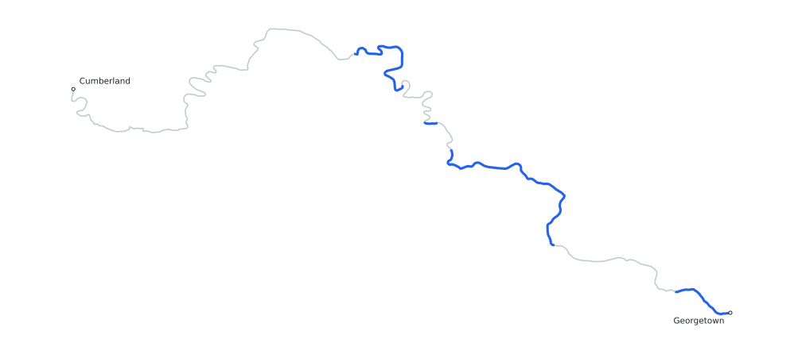

Track my progress running, biking, and hiking the 184.5-mile C&O Canal towpath.

## Progress

```{ojs}
//| echo: false

coverage = FileAttachment("data/public/json/coverage.json").json()

viewof coverageMode = Inputs.radio(
  ["Combined", "Run", "Bike", "Hike"],
  {label: "Coverage", value: "Combined"}
)

segmentsByMode = ({
  Combined: coverage.completed_segments,
  Run: coverage.run_segments,
  Bike: coverage.bike_segments,
  Hike: coverage.hike_segments
})

canalRuler = {
  const svgNamespace = "http://www.w3.org/2000/svg";
  const chartWidth = Math.max(width, 320);
  const chartHeight = 100;
  const lineY = 43;
  const lineHeight = 16;
  const totalMiles = coverage.canal_miles;
  const segments = segmentsByMode[coverageMode];
  const position = (milepost) => milepost / totalMiles * chartWidth;
  const makeSvgElement = (name, attributes = {}) => {
    const element = document.createElementNS(svgNamespace, name);
    for (const [key, value] of Object.entries(attributes)) {
      element.setAttribute(key, value);
    }
    return element;
  };
  const addText = (text, x, y, anchor) => {
    const label = makeSvgElement("text", {
      x,
      y,
      "text-anchor": anchor,
      fill: "currentColor",
      "font-size": 13
    });
    label.textContent = text;
    svg.append(label);
  };

  const svg = makeSvgElement("svg", {
    viewBox: `0 0 ${chartWidth} ${chartHeight}`,
    width: "100%",
    role: "img",
    "aria-label": `${coverageMode} C&O Canal coverage from Georgetown at milepost 0 to Cumberland at milepost ${totalMiles}`,
    style: "display: block; max-width: 100%; height: auto; font-family: system-ui, sans-serif;"
  });

  addText("Georgetown", 0, 18, "start");
  addText("Cumberland", chartWidth, 18, "end");

  svg.append(makeSvgElement("rect", {
    x: 0,
    y: lineY,
    width: chartWidth,
    height: lineHeight,
    rx: lineHeight / 2,
    fill: "#d1d5db"
  }));

  for (const segment of segments) {
    const covered = makeSvgElement("rect", {
      x: position(segment.start_milepost),
      y: lineY,
      width: position(segment.end_milepost) - position(segment.start_milepost),
      height: lineHeight,
      fill: "#2563eb"
    });
    const tooltip = makeSvgElement("title");
    tooltip.textContent = `MP ${segment.start_milepost}–${segment.end_milepost}\n${segment.miles} miles`;
    covered.append(tooltip);
    svg.append(covered);
  }

  addText("MP 0", 0, 82, "start");
  addText(`MP ${totalMiles}`, chartWidth, 82, "end");

  return svg;
}
```

## Map

{fig-alt="Geographic map of the C&O Canal towpath from Georgetown to Cumberland, with traveled sections highlighted in blue."}

## Recent Progress

Recent activities coming soon.

## Remaining Gaps

Remaining sections coming soon.
